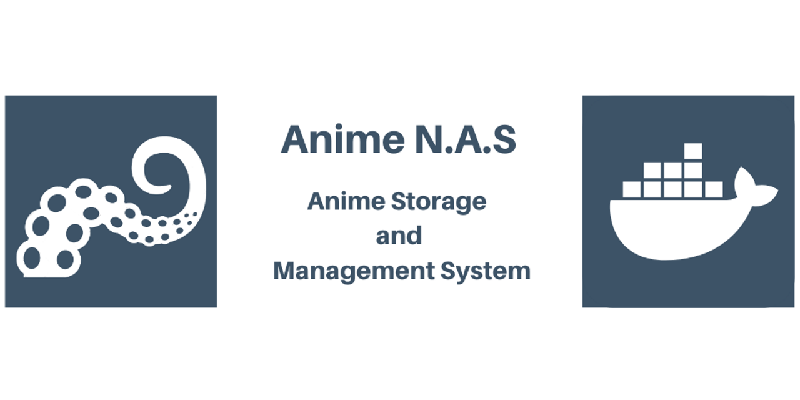
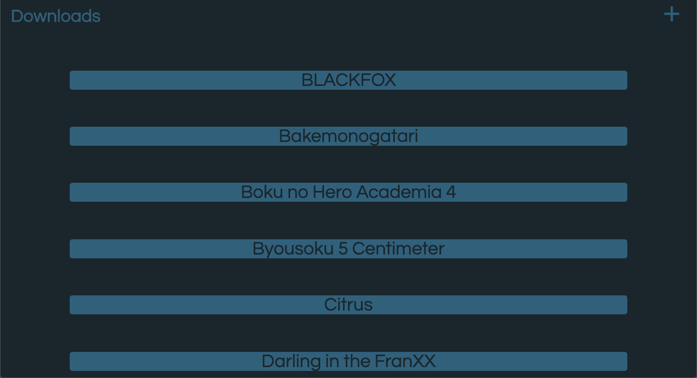

# ANIME N.A.S

• ANIME N.A.S is a Raspberry pi based home anime server, writen in python and built around docker, that automatically downloads and manages your anime colection. 

 

 

## Details

• Application built with docker.

• The application uses python as the main programming language.

• In My set up I'm using a  Raspberry Pi 3b+ and a 2.5" 500 GB HDD as the "server".

• It uses MySQL to store the path to all the anime episodes downloaded to the system as well as  "Favorites", "Watching", and "Downloaded" lists.

• If you add an anime to the "Downloaded" list it will automatically download all episodes for that anime from the website [twist.moe](https://twist.moe/) using the python.

• It also uses the  [Kitsu.io](https://kitsu.docs.apiary.io/) api to get the thumbnails for all animes in the database.

• The front end is made using HTML5 and css, and it is served by the flask application. 

• It can be accessed from any device within the same network.

## Getting Started

• Since the whole system is built with docker, the instalation is straight forward:

   1. Download the [set_up.sh](set_up.sh) file by typing the following command in the terminal:
      `curl https://raw.githubusercontent.com/Pedro4064/Anime-NAS/Docker_Develop/set_up.sh > set_up.sh`
   
   2. After the download is complete, make the file excecutable:
      `chmod +x set_up.sh`

   3. Run the bash script that will download all the necessary tools and set up the whole system, you should pass the path to the hardrive as an argument, where all the anime episodes and data are going to be stored:
      `sudo ./set_up.sh path_to_hardrive`
    
   *obs: replace `path_to_hardrive` with the path to your HDD

   
   4. Once information stops being printed to the terminal, the system setup is done. To initialize and populate the database, access (on your browser):
   `your_pi_IP_Adress:80/setUp`

   5. Once the webpage shows `Set up Done`. You can access the the webapp (from any device in the network) at the address:
   `your_pi_IP_Adress:80/Animes`

## Adding new anime season to the databse
• Once there is a new season of anime, we can update the database by accessing (on your browser):
`your_pi_IP_Adress:8080/update`